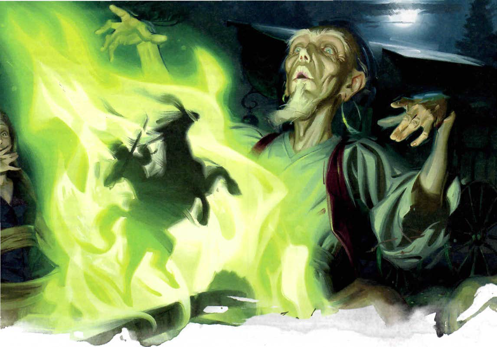
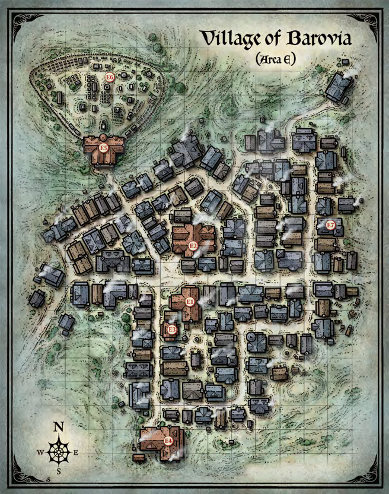

# Writeup from Session 1

## Chain of events

### Starting town

#### ???

Royal told us to get rid of some annoying outsiders.
We prepare some gear, and all meet in an inn in the evening.

#### Inn

We get some intel about the outsiders from the innkeeper, spend the night, and head out the next morning.

#### Outsiders tents

We talk to the outsiders, asking them to leave.
They agree to leave, on the condition that we help them back in their hometown, Barovia.
We accept, and we leave towards their town.

### Travel to the outsiders' hometown

#### ???

Nothing of interest happened.

### Barovia

#### Somewhere in town

We reached their town, and got pretty quickly approached by two children who told us about a monster living in their house.
We agreed to try and save them, so they led us to their house.

#### House

From the outside, the house looked very shabby/burnt.
The front gate was open, so we decided to go in.

##### First floor

Nothing of interest was in the hallway.
When we entered the first bigger room, it looked very clean and tidy. Almost eerily tidy.
As we checked the dining room, we found a secret room. It was full of cobwebs and rotting tapesty. Otherwise, the dining room was clean.
We checked the living room. It contained some stuffed wolves, a locked closet, and a set of crossbows and bolts hanging on the wall.
When we checked the kitchen a few minutes later, the kitchen suddenly looked extremely abandoned and dirty.
The kitchen had a dumbwaiter, but did not contain anything of interest otherwise.
There were no other rooms on the first floor, so we decided to continue to the second floor.

##### Second floor

The second floor began with a dark room full of armours on stands, with pretty murals on the walls. After closer inspection (and lighting some lamps), the muruals change to depict some horrible scenarios.
The first room we inspect had a piano, closed windows, and more murals on the walls.
Rokner inspected the murals (all bad again), and after checking the energies of this place, notices some very bad (not evil) energies coming from all over the house.
Meanwhile, Lilly sneaked loudly back down the stairs with a loud thud (which Roux mimicked comically).
Lilly sneaked back into the living room in the first floor, and tried to steal something from the aforementioned locked closet. While doing that, she had a staring battle with one of the stuffed wolves. She fled back with empty hands to us afterwards.
We checked out the library. It had a secret room, which contained a skeleton in leather armour, as well as a chest. The chest contained some documents relating to the house, as well as some magic scrolls.
There was another room, but it contained nothing of interest.
We decided to move on to the third floor.

##### Third floor

When we entered the third floor, an animated armour suddenly attacked.
After a quick battle and some heals by Rokner, we continue with minimal damage.
We check out a childrens bedroom, with nothing of interest in it.
We inspect the storage room. It contains a corpse, but it's not of any interest either.
Meanwhile, Lilly breaks a lockpick trying to pick open a locked door, so we just resort to trying to bust through the door with out weapons (we succeed after a while).
In the locked room are two corpses; they seem to be the children that asked us to attack.
After moving the corpses into the beds in that room, we notice that there's a dollhouse in this room that seems to exactly mirror this house.
Thanks to the dollhouse, we find a flight of stairs leading to the basement from this floor.
Ignoring the last room on this floor, we proceed to the basement.

##### Basement

After entering the basement, we find some crypts with the names of the children on it.
We proceed to lie the corpses from the previous floor into the corresponding crypts, and their souls thank us for it.
We proceed through some more room, and find a room with a well that leads to the dumbwaiter, as well as multiple beds and chests (which we proceed to loot).
Rivet comes up the dumbwaiter and joins our party.
Lilly walks off and down a hallway, but triggers a spike trap.
Rokner tries to pull her out by lowering Rivet into the hole, but he accidentally let's go of rivet.
Rivet falls into the hole too, and now Duncan joins Rokner in trying to get the other two out.
Duncan manages to rescue both from the hole, and everyone recieves some healing.
We decide to take a long rest, and Roux keeps watch for the night.

---

End of session 1

## Next Session

- [Session 2](session2.md)
