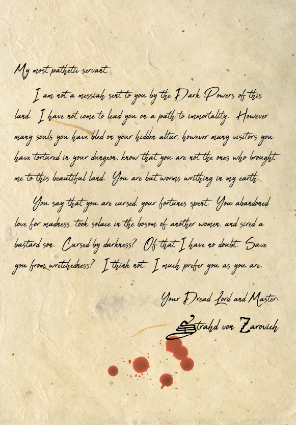
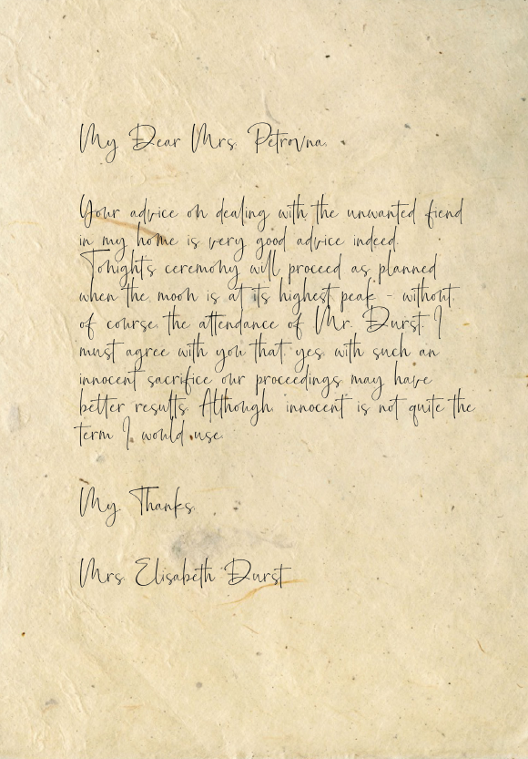
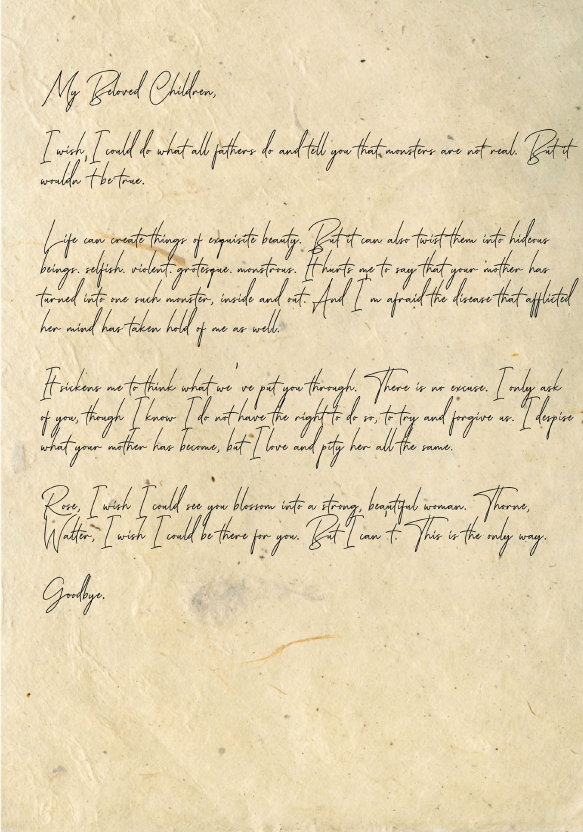

# Writeup from Session 2

## Last Session

- [Session 1](session1.md)

## Chain of events

### Barovia 

#### Basement of the House

Since Lilly had a little adventure in the spike pit yesterday, we let her rest for a while longer. Meanwhile, Duncan, Rivet and Roux found some letters in our nightquarters.

Letter from Strahd:

Letter from the mom

Letter from the dad

After reading through these letters, we decided to continue exploring past the spike pit.

As we went into the first room behind the spike pit, we encountered a ghoul, but we quickly bashed it into the next wall. Other than the bloody spot we produced, there was nothing else of interest in that room.

In the next room we found a big statue with a glistening gem in it. Duncan decided to behead it, which caused three shadows to appear. After some fighting (and unsuccessful hugging), we beat them, despite Rivet getting knocked unconcious.

Duncan healed Rivet back up, and was already off to go into the next room. 

The only problem with that plan was, that the door to the next room suddenly tried to take a bite out of him. After he freed himself, we decided that looking for another path is probably a good idea. We went down the other part in the ghoul room that we skipped at first, and it lead to the room behind the mimic.

The room didn't have much to offer other than an old book on the table.

The next room seemed to be 

Back in the mimics room, the book on the table seemed to reach out to Roux. The sigils on it seemed to be related to Azimoth, but Roux broke free from it and threw it at the mimic, which promptly ate it. To everyones suprise, the mimic spontaneously started liquifying.

We then decided that there was nothing more of interest down here, and continued on. 

On our way back we passed some coffins, and we met the childrens' spirits again. After hearing some more of their story (Their dad locked them in their room to protect them to the monster, but he never came back, so they starved), we assured them that we'll take care of the monster and that they should just rest for now.

Going back down, we discovered that one of the rooms still had an animated broomstick in it. We didn't open the room, so there was no problem there.

In another room, which seemed to be the nannys bedroom, we met the spirit of the nanny. She informed us that there's possibly a third kid, and that she might have had an affair with the father.

After we're done talking to her, we continue to the last room on this floor.
It had nothing of interest, other than the fact that Roux saw a dog outside.

---

End of Session 2