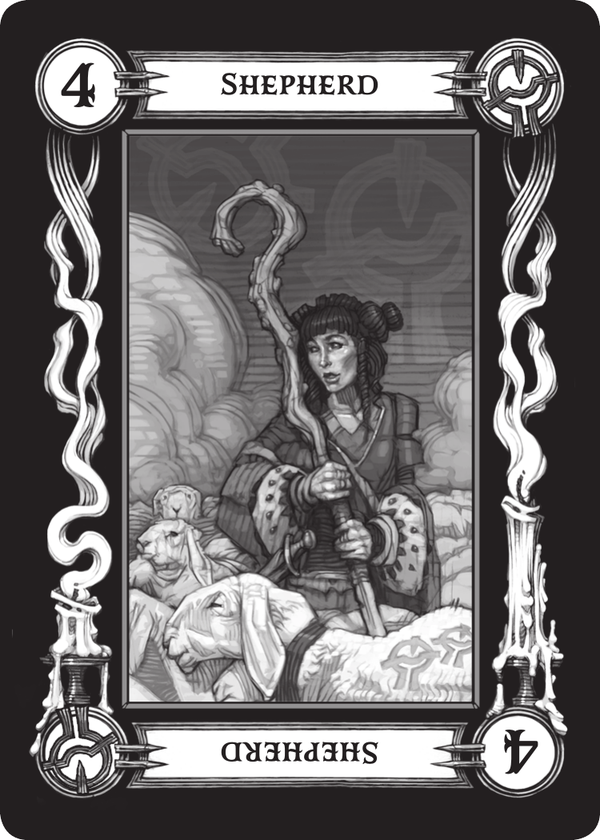
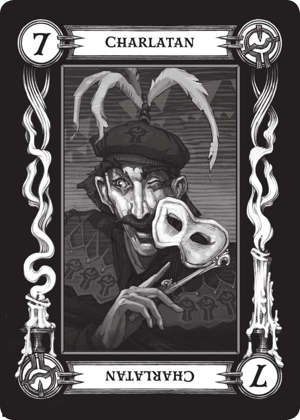
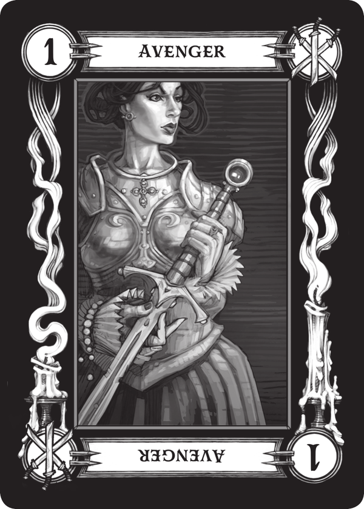
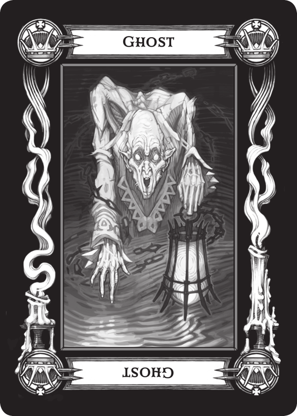
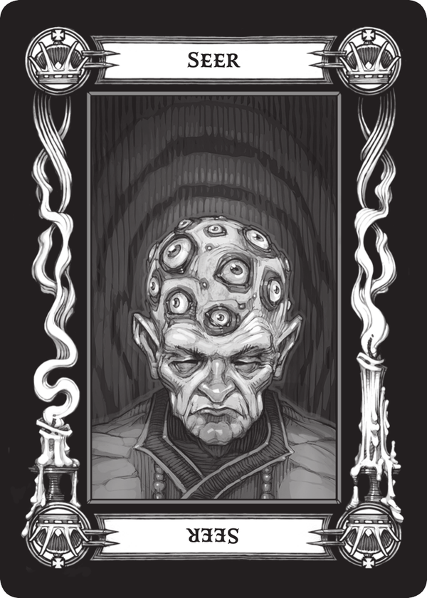

# Writeup from Session 5

## Last Session

- [Session 4](session4.md)

## Chain of events

### Path to Valechia

After last times fight with a wolf pack, we continued our travel, and came across a small encampment of Visanti, the nomad people that have brought us to this land.

#### Visanti encampment

We joined the Viscanti at their campfire; We exchanged stories, had some drinks, and were offered a reading of our fortunes by the groups fortune teller, Madame Eva.

In Madame Evas tent we all gathered around a small velvet table, as she got out a deck of tarokka cars and started laying them out in front of us.

The cards and the corresponding info she gave us are as follows:

##### 1. 4 of Glyphs - Shepherd

This card tells of history. Knowledge of the ancient will help you better understand your enemy.

_"Find the mother - she who gave birth to evil."_

##### 2. 7 of Glyphs - Charlatan

This card tells of a powerful force for good and protection, a holy symbol of great hope.

_"I see a lonely mill on a precipice. The treasure lies within."_

##### 3. 1 of Swords - Avenger

This is a card of power and strength. It tells of a weapon of vengeance: a sword of sunlight.

_"The treasure lies in a dragon’s house, in hands once clean and now corrupted."_

##### 4. King Of Hearts - Ghost

This card sheds light on one who will help you greatly in the battle against darkness.

_"I see a fallen paladin of a fallen order of knights. He lingers like a ghost in a dead dragon's lair."_

##### 5. Jack of Clubs - Seer

Your enemy is a creature of darkness, whose powers are beyond mortality. This card will lead you to him!

_"He waits for you in a place of wisdom, warmth, and despair. Great secrets are there."_

After she read us our fortunes, we were offered a place to sleep for the night. 
The next morning we thanked everyone for their hospitality, and continued our travel.

#### Back on the path to Valechia

As we continued our trip, we were followed by a lone raven. We passed a lone mill on a hill, and while we were intrigued to enter it, the raven lead us into a different direction. As we continues, we also passed an eerily empty carriage, and not long after, Valechia began appearing in the distance.

---

End of Session 5

## Next Session

- [Session 6](session6.md)